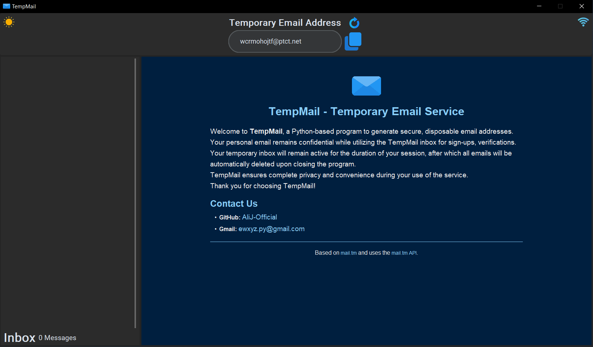
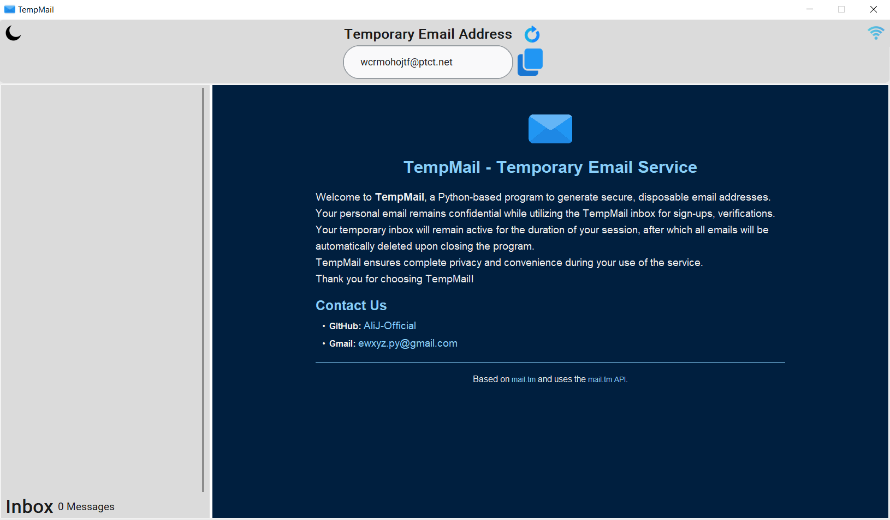

<p align="center">
  <picture>
    <source media="(prefers-color-scheme: dark)" srcset="./Icons/TempMail.ico">
    
  </picture>
</p>

**TempMail** is a Python-based GUI program designed to provide users with temporary email addresses and inbox management. Built with simplicity and anonymity in mind, it leverages the **mail.tm API** to create disposable email accounts, making it perfect for signing up on websites or services without revealing your personal email.

---

## ✨ Key Features

- **Disposable Email Addresses** – Instantly generate temporary email addresses for anonymous use.
- **Inbox Management** – View and read emails in your temporary inbox with ease.
- **Real-Time Notifications** – Get notified when a new email arrives. Click the notification to bring the program window to the top.
- **Email Ready Notification** – Receive a notification when your temporary email is ready. Click it to copy the email address to your clipboard instantly.
- **Real-Time Connectivity Monitoring** – Stay informed about your internet connection status.
- **Theme Support** – Switch between **light** and **dark** themes for a personalized experience.

---

## 📸 Screenshots




---

## 📂 Project Structure

```
📂 TempMail/
├── 📂 Icons/             # Contains all UI icons and images
├── 📂 Modules/           
│   ├── 📄 __init__.py     # Python import modules manager
│   ├── 📄 TempMail_API.py # Handles application backend 
│   └── 📄 CoreB.py        # Core functionality module
├── 📂 Screenshots         # Contains UI Screenshots
├── 📄 AutoInstaller.bat  # AutoInstaller script for Windows
├── 📄 HomePage.html       # HomePage HTML file for UI
├── 📄 LICENSE  
├── 📄 README.md           # Project documentation
├── 📄 TempMail.py         # GUI application script
├── 📄 requirements.txt    # Lists all required dependencies
```

---

## 🛠️ Installation

### 🔹 Download the Release (Recommended)

1. Visit the [Releases](https://github.com/AliJ-Official/TempMail/releases) page of this repository.
2. Download the latest version of the program:
   - **TempMail_2.0.1_x64.exe**: An installer file for setting up the program on your system.
3. Run `TempMail_2.0.1_x64.exe` and follow the on-screen instructions to install the program.
4. Once installed, you can launch the program from the Start Menu or Desktop shortcut.

---

### 🔹 Automatic Installation (For Developers)

1. Clone the repository using this command:
   ```bash
   git clone https://github.com/AliJ-Official/TempMail.git
   ```

- If you don't have git installed on your system, you can download the zip file from this [link](https://codeload.github.com/AliJ-Official/TempMail/zip/refs/heads/main) and follow the steps below.

2. Navigate to the TempMail directory.

3. Ensure you have an active internet connection and run the **AutoInstaller.bat** script.

4. Follow the on-screen instructions to select your Python version and complete the installation.

5. **Run via Python**:
   - After installation, you can run the program using:
     ```bash
     python TempMail.py
     ```

---

### 🔹 Manual Installation (For Developers)

1. Clone the repository using this command:
   ```bash
   git clone https://github.com/AliJ-Official/TempMail.git
   ```
- If you don't have git installed on your system, you can download the zip file from this [link](https://codeload.github.com/AliJ-Official/TempMail/zip/refs/heads/main) and follow the steps below.

2. Navigate to the TempMail directory.

3. Open powershell or cmd in the TempMail directory.

4. Create and activate a Virtual Environment (recommended):
   ```bash
   python -m venv .venv
   .venv/Scripts/activate.bat
   ```

5. Install the required dependencies:
   ```bash
   pip install -r requirements.txt
   ```

6. **Run via Python**:
   - Run the program using:
     ```bash
     python TempMail.py
     ```

7. To deactivate the Virtual Environment:
   ```bash
   deactivate
   ```

- Alternatively, you can run the program without activating the Virtual Environment:
   ```bash
   .venv/Scripts/python.exe TempMail.py
   ```

---

## 🤝 Contributing

We welcome contributions! If you'd like to contribute to TempMail, follow these steps:

1. Fork the repository.
2. Create a new branch for your feature or bug fix.
3. Commit your changes.
4. Push your branch and open a pull request.

Please ensure your code follows the project's style and includes appropriate documentation.

---

## 🙏 Acknowledgments

This project includes code from [CoreB](https://github.com/mmji-programming/CoreB.git), licensed under the MIT License.  
CoreB is a lightweight and efficient concurrency management library that provides threading controllers, task execution, and queue management.  
In this program, CoreB is used for managing background tasks, ensuring smooth and efficient asynchronous execution.

---

## 📜 License

TempMail is licensed under the **MIT License**. See the [LICENSE](LICENSE) file for more details.

---

**Thank you for using TempMail!** If you encounter any issues or have suggestions for improvement, feel free to open an issue or contribute to the project.
